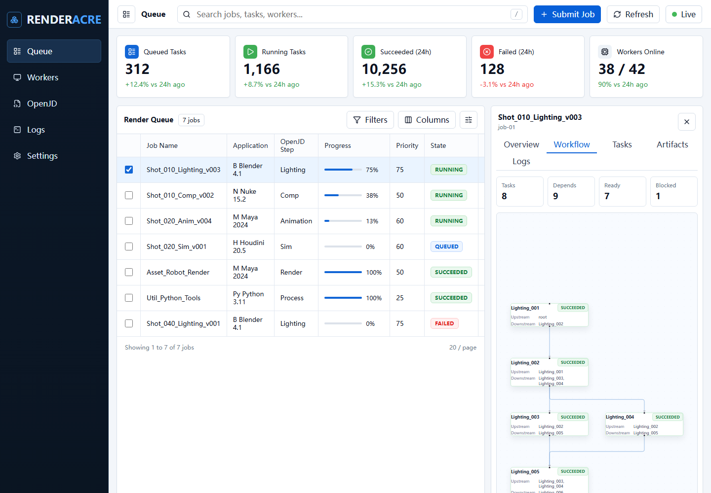

# Renderacre

[](https://github.com/loonghao/renderacre/actions/workflows/ci.yml)
[](https://github.com/loonghao/renderacre/actions/workflows/dcc-e2e.yml)
[](https://github.com/loonghao/renderacre/actions/workflows/release.yml)
[](https://github.com/loonghao/renderacre/releases)
[](https://pypi.org/project/renderacre/)
[](https://pypi.org/project/renderacre/)
[](https://pepy.tech/project/renderacre)
[](LICENSE)

Renderacre is a Rust render-farm foundation inspired by Deadline: a remote controller API, standalone workers, Python submitter bindings, and Open Job Description (OpenJD) job templates for portable DCC and batch workloads.

The Python package is named `renderacre` and is built as a `cp37-abi3` wheel, so one wheel supports CPython 3.7 and newer on each platform.

## Installation

Install the Python submitter API from PyPI:

```bash
python -m pip install renderacre
```

The published wheels use `cp37-abi3`, which means each platform wheel supports CPython 3.7 and newer.

Install the standalone controller and worker binaries from GitHub Releases.

Linux/macOS:

```bash
curl -fsSL https://raw.githubusercontent.com/loonghao/renderacre/main/scripts/install.sh | bash
```

Windows PowerShell:

```powershell
iwr https://raw.githubusercontent.com/loonghao/renderacre/main/scripts/install.ps1 -UseB | iex
```

Pin a release or install directory when deploying render nodes:

```bash
export RENDERACRE_VERSION=v0.1.4
export RENDERACRE_INSTALL_DIR=/opt/renderacre/bin
curl -fsSL https://raw.githubusercontent.com/loonghao/renderacre/main/scripts/install.sh | bash
```

```powershell
$env:RENDERACRE_VERSION = "v0.1.4"
$env:RENDERACRE_INSTALL_DIR = "$env:LOCALAPPDATA\renderacre\bin"
iwr https://raw.githubusercontent.com/loonghao/renderacre/main/scripts/install.ps1 -UseB | iex
```

After installation, run the farm processes:

```bash
renderacre-controller --bind 0.0.0.0:7878
renderacre-worker --controller http://controller-host:7878 --name render-node-01 --label app=blender
```

For source builds:

```bash
cargo install --path crates/farm-controller --locked
cargo install --path crates/farm-worker --locked
```

## Features

- Rust HTTP controller with job submission, worker registration, leasing, retries, task dependencies, and job state inspection.
- Standalone worker binary that executes direct commands or OpenJD runtime payloads.
- Controller-collected worker logs, controller events, task stdout/stderr tails, downloadable task artifacts, and upstream/downstream task dependency tracking.
- Official `openjd-model` validation and job creation for OpenJD `jobtemplate-2023-09`.
- Official `openjd-sessions` execution for OpenJD step scripts, task parameters, environments, embedded files, and OpenJD stdout directives.
- PyO3/maturin Python module for pipeline submitters and DCC tools.
- CI for fmt, clippy, unit tests, controller/worker e2e smoke, and ABI3 wheel builds.
- Release workflow for cross-platform wheels, sdist, and PyPI Trusted Publishing.

## Local Development

```powershell
cargo test --workspace
cargo clippy --workspace --all-targets -- -D warnings
powershell -NoProfile -ExecutionPolicy Bypass -File .\scripts\e2e_smoke.ps1
python .\scripts\e2e_dcc_tasks.py --jobs python
python -m maturin build --release -o target\wheels
```

The wheel filename should contain `cp37-abi3`, for example:

```text
renderacre-0.1.4-cp37-abi3-win_amd64.whl
```

## Run a Local Farm

Start the controller:

```powershell
cargo run -p renderacre-controller -- --bind 127.0.0.1:7878
```

The controller defaults to the in-memory scheduler for demos and tests. Use the
SQLite backend for a lightweight durable farm:

```powershell
cargo run -p renderacre-controller -- --storage sqlite --sqlite-path .\renderacre.sqlite3
```

Start a worker:

```powershell
cargo run -p renderacre-worker -- --controller http://127.0.0.1:7878 --name local-worker --label os=windows
```

Submit a direct command job:

```powershell
Invoke-RestMethod `
  -Method Post `
  -Uri http://127.0.0.1:7878/v1/jobs `
  -ContentType application/json `
  -InFile .\examples\hello_job.json
```

## Python Submitter API

Install a local build:

```powershell
python -m pip install maturin
python -m maturin develop
```

Submit a command job:

```python
import renderacre

job_json = renderacre.command_job(
    "hello-from-python",
    "python",
    ["-c", "print('hello from renderacre')"],
)
print(renderacre.submit_job("http://127.0.0.1:7878", job_json))
```

Submit an OpenJD template:

```python
import json
import renderacre

template = open("examples/openjd_python_frames.yaml", encoding="utf-8").read()
job_json = renderacre.openjd_job(
    "openjd-demo",
    template,
    json.dumps({"Message": "hello through OpenJD"}),
)
print(renderacre.submit_job("http://127.0.0.1:7878", job_json))
```

## OpenJD Support

Renderacre accepts an OpenJD job template under `openjd.template_yaml`.

The controller:

1. Parses YAML/JSON with the official OpenJD parser.
2. Validates the template and enabled extensions.
3. Preprocesses typed job parameters, including `PATH` values.
4. Creates the resolved OpenJD job model.
5. Expands step parameter spaces into farm tasks.

The worker:

1. Creates an OpenJD session.
2. Enters job and step environments.
3. Runs each OpenJD task through `openjd-sessions`.
4. Captures stdout/status and reports the result to the controller.
5. Exits environments and cleans the session directory.

Supported current extensions default to all extensions known by `openjd-model`: `EXPR`, `FEATURE_BUNDLE_1`, `TASK_CHUNKING`, and `REDACTED_ENV_VARS`.

## Dashboard

Renderacre includes a Vite + React dashboard under `dashboard/`. It uses modular React components, compact queue tables, worker status panels, per-worker live logs, an OpenJD task inspector, React Flow dependency graphs, downloadable artifacts, and stdout/stderr tail views.



Run it during development:

```powershell
cargo run -p renderacre-controller -- --bind 127.0.0.1:7878
cd dashboard
npm ci
npm run dev
```

The Vite dev server proxies `/v1` and `/healthz` to the controller. For a deployed dashboard:

```powershell
cd dashboard
npm run build
```

Serve `dashboard/dist` through your internal web server or reverse proxy next to the controller API.

## DCC Examples

Renderacre ships real OpenJD examples for Python frame tasks, Blender background
renders, and Maya standalone scene exports. The same templates are exercised by
the `DCC E2E` GitHub Actions workflow: Blender uses official Linux tarballs, and
Maya uses the `tahv/mayapy` container images.

Run the full DCC e2e suite on a machine that has Blender and Maya on `PATH`:

```powershell
python .\scripts\e2e_dcc_tasks.py --jobs all --blender-exe blender --maya-python mayapy
```

Run only the jobs available on the current machine:

```powershell
python .\scripts\e2e_dcc_tasks.py --jobs auto
```

Blender:

```powershell
$template = Get-Content .\examples\dcc\blender_render_openjd.yaml -Raw
$params = @{
  BlenderExecutable = "blender"
  ScriptPath = (Resolve-Path .\examples\dcc\blender_render_task.py).Path
  OutputDir = (Join-Path (Get-Location) "renders\blender")
} | ConvertTo-Json
```

Maya:

```powershell
$template = Get-Content .\examples\dcc\maya_render_openjd.yaml -Raw
$params = @{
  MayaPython = "mayapy"
  ScriptPath = (Resolve-Path .\examples\dcc\maya_render_task.py).Path
  OutputDir = (Join-Path (Get-Location) "renders\maya")
} | ConvertTo-Json
```

Pass the template and parameter JSON through `renderacre.openjd_job(...)` or submit the equivalent REST payload to `/v1/jobs`.

For CI parity, the script writes Blender PNGs and Maya `.ma` scenes under
`target/e2e-dcc/` and fails if any expected frame output is missing.

## Deployment

Recommended first deployment shape:

- Run one controller per farm or queue: `renderacre-controller --bind 0.0.0.0:7878`.
- Run one worker process per render node: `renderacre-worker --controller http://controller-host:7878 --name <node-name> --label app=blender`.
- Put the controller behind a private network or authenticated reverse proxy.
- Keep render executables and scripts on shared storage, then pass `PATH` parameters through OpenJD.
- Use GitHub Releases or PyPI to distribute the `renderacre` wheel to submitter machines.

SQLite is the default durable profile for small deployments. Start the
controller with `--storage sqlite --sqlite-path <path>` or set
`RFARM_STORAGE=sqlite` and `RFARM_SQLITE_PATH`. The scheduler API remains the
same for REST workers, dashboard reads, and Python submitters; future Postgres
or managed/cloud storage backends can replace the same storage boundary without
changing submitter contracts.

## Release

The release workflow builds Linux, Windows, and macOS wheels plus an sdist. PyPI publishing uses Trusted Publishing through the `pypi` GitHub environment.
It also uploads standalone controller/worker archives to GitHub Releases for Linux, macOS, and Windows.

Manual release dry run:

```powershell
python -m maturin build --release -o dist
python -m pip install twine
python -m twine check dist/*
```

Publish from GitHub:

1. Configure PyPI Trusted Publisher for `loonghao/renderacre`, workflow `release.yml`, environment `pypi`.
2. Push a `vX.Y.Z` tag or publish a GitHub Release.
3. The workflow uploads artifacts to PyPI when the publish gate is active.

See [docs/architecture.md](docs/architecture.md) for the internal layout.
